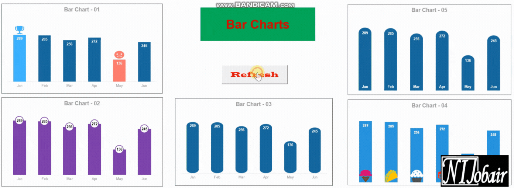
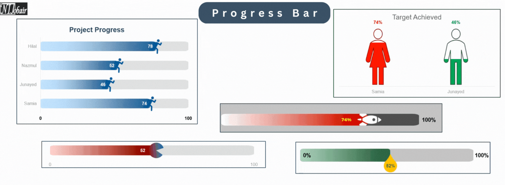
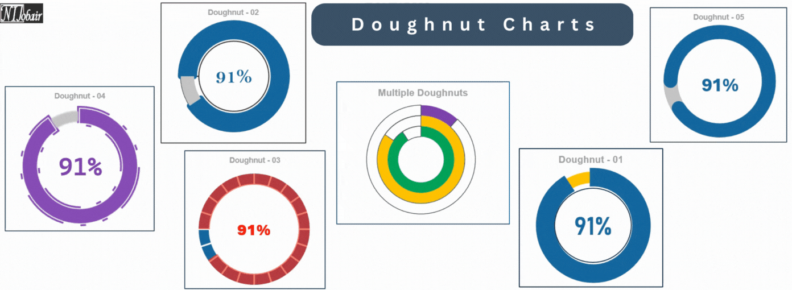

<!-- <h1 align="center">
    Data Visualization in Excel
</h1> -->

Data visualization is one of the most used and important features of Excel. Excel provides a lot of customizations as well for the charts. Based on the data and the goal of the visualization we can choose our chart from a number of options. Let's explore the Data Visualization world of Excel.

Broadly speaking, we can divide the charts in two types:

- Static
- Dynamic

## Static Charts

These are like snapshots of data at a specific point in time. Think of them as a single picture in a photo album. These charts don't update as the data changes over time. These charts are useful for one-time reporting, articles, and presentations. These are great for highlighting one or two aspects of the visualization. Some examples of static charts are given below:

## Dynamic Charts

Dynamic charts are the ones that updates automatically as the source data updates. As the data changes the visualization changes automatically. These are best for creating dashboards, visualizing change over time, etc. Below are some of the most popular chart types used in Excel. All of these are dynamic.

### 1. Bar Charts

Bar charts, sometimes called bar graphs, are a way to visualize data using rectangles. These rectangles, or bars, aren't all the same size - their height or length corresponds to a specific value in your data set. This lets us easily compare different categories of information at a glance.

### 2. Progress Bars

Progress bars are those familiar visual gauges we see on computers and devices that show us how far along a process is. Imagine downloading a large movie. A progress bar shows us the download's progress, so we know it's not stuck and we can roughly estimate how much longer it will take to enjoy your movie.

### 3. Pie Charts

### 4. Doughnut Charts

Doughnut charts, named for their resemblance to the tasty pastry, are a variation of pie charts. They look like pie charts with a hole in the center. These can be used to make comparisons and indicate progress.

